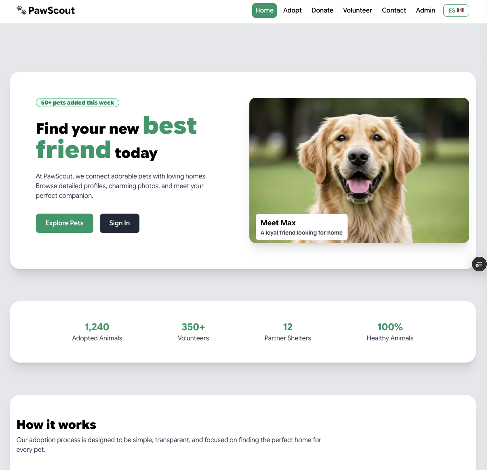

## TL;DR for Recruiters

- End-to-end product: design, development, and localization
- Bilingual architecture powered by strongly typed dictionaries (i18n)
- Realistic adoption, donation, and volunteer funnels with mock data
- Public + admin route groups that prove scalability across surfaces
- Built with Next.js App Router, TypeScript, Tailwind CSS, and Framer Motion
- Intended as an in-kind donation for an animal shelter partner

<div align="center">

# PawScout Frontend

Human-centered platform that lets future pet parents, donors, and volunteers collaborate with PawScout rescues through a polished, bilingual web experience.

</div>

## Mission & Context

This is a personal end-to-end build that I designed, engineered, and localized to showcase my product thinking for animal-welfare initiatives. The application will be donated to a real shelter once content and integrations are production-ready. Because it is part of my portfolio, I am not accepting external code contributions.

## Live Demo

- Latest preview: [https://paw-scout.vercel.app/](https://paw-scout.vercel.app/)
- Tested on desktop and mobile (iOS Safari, Android Chrome) to ensure every funnel stays responsive.

## UI Preview



## Experience Highlights

- **Adoption Flow** – `/app/(public)/adopt` renders hero storytelling, filterable dog grids, and `[slug]/info` detail views backed by `db/dogs.ts` mock data. Forms under `[slug]/adopt-form` capture intent and route to bilingual success screens.
- **Donation Journey** – `/app/(public)/donate` combines impact storytelling (`components/public/donate/HeroDonate.tsx`) with amount selectors, transparency cards, and success narratives to build trust.
- **Volunteer Pipeline** – `/app/(public)/volunteer` covers requirements, role deep dives, and a form + thank-you state under `volunteer/form`. Inputs are validated and copy is fully localized.
- **Contact Hub** – `/app/(public)/contact` blends hero content, outreach cards, and a localized form fed by `lib/i18n/contact/*` dictionaries so the rescue can triage adoption, rescue, or donation requests.
- **Admin Preview** – `/app/(admin)` demonstrates how the same design system scales to internal dashboards (adoptions, donations, pets, volunteers, settings) even though data is mocked today.

## Why It Stands Out For Recruiters

- **Bilingual Copy Platform** – Every public route reads from strongly typed dictionaries in `lib/i18n/**`, allowing instant locale switching (`[lang]` segments) without duplicating components.
- **Compositional Design System** – Shared UI primitives live in `components/ui` (headers, cards, global footer) and power both public and admin surfaces.
- **Story-Driven Funnels** – Each flow mixes motion (`framer-motion`), iconography (`@heroicons/react`), and CTAs that map to real shelter KPIs: adoptions completed, donations pledged, volunteer hours scheduled.
- **Realistic Data Model** – Even without APIs, `db/dogs.ts` expresses the fields (temperament, health, requirements) a shelter CMS would expose, proving readiness for backend integration.

## Tech Stack

| Layer     | Details                                                                  |
| --------- | ------------------------------------------------------------------------ |
| Framework | Next.js 16.1 (App Router, Server + Client Components, Route Groups)      |
| Language  | TypeScript 5.0 + React 19                                                |
| Styling   | Tailwind CSS 4 utilities, motion micro-interactions via Framer Motion    |
| UI Assets | Heroicons 2, custom SVG/imagery in `/public`, responsive CSS grid system |
| Tooling   | pnpm, ESLint 9 (`eslint-config-next`), PostCSS, TypeScript strict mode   |

## System Architecture

- **Routing Layout** – Split between `(public)` and `(admin)` route groups. Each section has its own `layout.tsx` to inject context-specific chrome while inheriting global providers from `app/layout.tsx`.
- **Localization Engine** – `get*Content` helpers (e.g., `lib/i18n/contact/contact-form.ts`) return `{ lang, content }` objects consumed by client components via `useParams`. This pattern keeps copy centralized and makes adding new locales trivial.
- **Design Tokens** – `app/globals.css` seeds Tailwind presets, typography scales, and reusable utility classes to ensure brand consistency.
- **Data & Mock Services** – `db/dogs.ts` mimics a CMS payload; additional data is encoded directly in dictionaries so the UI is production-ready once endpoints are available.
- **Animation & Interaction** – Hero sections, cards, and CTA panels rely on Framer Motion for subtle entrance transitions that elevate perceived quality without harming performance.

## Project Structure (High-Level)

```
frontend/
├── app/
│   ├── (public)/home, adopt, donate, volunteer, contact, auth flows, etc.
│   └── (admin)/admin dashboard sections for future shelter staff tooling
├── components/
│   ├── public/… feature-specific blocks
│   ├── admin/… settings and dashboards
│   └── ui/ shared primitives (headers, footers, cards)
├── lib/i18n/ dictionaries powering bilingual copy
├── db/dogs.ts mock dataset for adoption catalog
└── public/ static imagery and icons
```

## Setup & Local Development

```bash
# prerequisites
node --version  # >= 20
pnpm --version  # >= 8

pnpm install
pnpm dev       # http://localhost:3000

pnpm lint      # ESLint + TypeScript checks
pnpm build     # Production bundle (Next.js standalone)
pnpm start     # Serve .next output
```

## Quality & Accessibility

- Strict TypeScript plus ESLint keeps every route segment aligned with React 19 best practices.
- Form components ship with labels, `aria`-friendly focus states, and keyboard-safe controls.
- I rely on design tokens and responsive utilities to maintain readability across breakpoints.

## Roadmap & Donation Plan

1. Replace mock dog data with a headless CMS or shelter API.
2. Wire form submissions to a transactional email or CRM service.
3. Harden authentication for the `(admin)` workspace so shelter staff can manage pets, donations, and volunteers.
4. Transfer the finished codebase to a partner rescue organization as an in-kind donation.

## Contribution Policy

This repository is a personal portfolio project. Please do not submit pull requests or feature requests. If you are evaluating my work for a role, feel free to reach out via LinkedIn or email instead.

---

Thank you for reviewing PawScout Frontend. I am excited to bring the same care and execution to your engineering team.
